# Task Manager
# Веб-приложение по управлению задачами

Веб-приложения по управлению задачами, которое позволяет создавать, обновлять и изменять порядок задач соответствуя ее этапу выполнения.

## Функциональные требования:
1. Просмотр задач пользователем
2. Создание задачи пользователем с возможностью заполнения следующих полей:
   * Название задачи
   * Срок выполнения
   * Исполнители задачи
   * Прикрепленный файл
   * Комментарий
3. Обновление следующих полей задачи пользователем:
   * Исполнители задачи
   * Срок выполнения
   * Состояние, к которому должна принадлежать задача
4. Перемещение задачи между состояниями по следующим правилам:
   * Из состояния “Неразобранные задачи” к “В планах‘ и наоборот
   * Из состояния “В планах” к “В работе” и наоборот
   * Из состояния “В работе” к “Выполнено” и наоборот
5. Удаление пользователем последней задачи в списке определенного состояния
6. При клике на задачу открывается модальное окно изменения полей задачи, описанное в пункте 3.
7. Изменение пользователем приоритетности задачи посредством изменения последовательности задачи в определенном состоянии

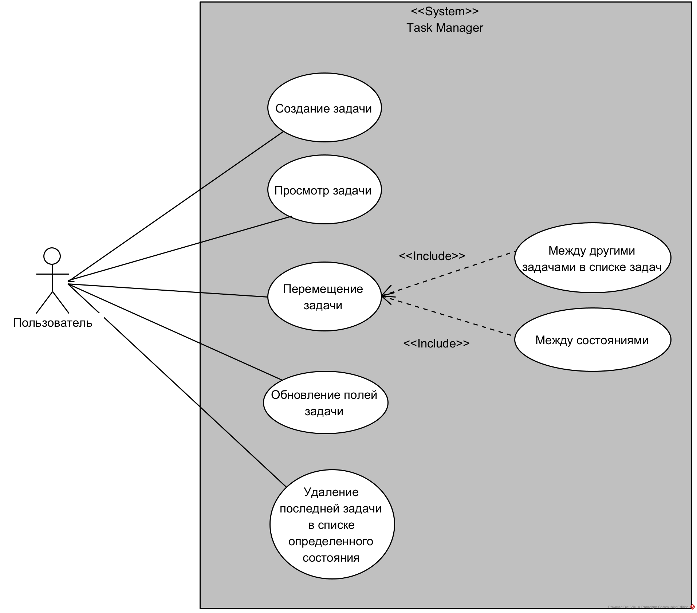

*Диаграмма вариантов использования*

## Нефункциональные требования
1. Стек технологий:
   * React.js (18.2.0)
   * Webpack (5.85.1)
   * SСSS (6.8.1)
   * Redux-Toolkit (1.9.5)
   * React-Beautiful-DnD (13.1.1)
   * CSS
   * HTML
   * Javascript
2. Перемещение задач с использованием Drag&Drop
3. Статическое хранение исполнителей вне Redux хранилища

## Архитектура приложения
Веб-приложение по управлению задачами представляет собой одностраничное приложение (SPA - Single Page Application), в котором единственный HTML-документ имеет и исполняет весь реализуемый функционал.
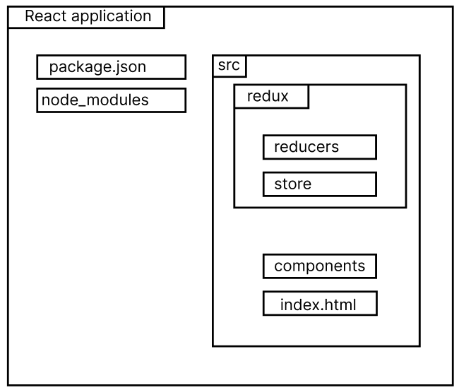

*Архитектура приложения*

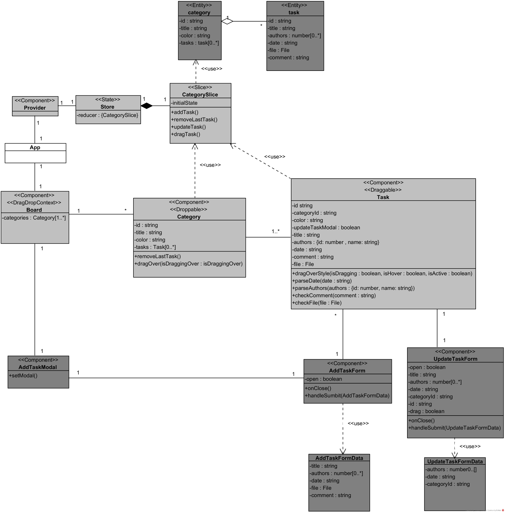

*Диаграмма классов программной архитектуры приложения*

## Тестирование приложения
| TC ID | Заголовок                                                              | Предусловия                     |                                                                                  Шаги                                                                                  | Ожидаемый результат                                                                                                                                                                                                                                                  | Результат выполнения |
|-------|------------------------------------------------------------------------|---------------------------------|:----------------------------------------------------------------------------------------------------------------------------------------------------------------------:|----------------------------------------------------------------------------------------------------------------------------------------------------------------------------------------------------------------------------------------------------------------------|---------------------:|
| 1     | Клик на задачу                                                         | Не менее одной созданной задачи |                                                                           Нажимаем на задачу                                                                           | Появляющаяся форма обновления полей задачи                                                                                                                                                                                                                           |               Passed |
| 2     | Drag между задачами в определенном состоянии                           | Не менее двух созданных задач   |                                        Нажимаем и удерживаем область задачи; Перетаскиваем задачу ниже/выше по вертикальной оси                                        | Изменение положения задачи                                                                                                                                                                                                                                           |               Passed |
| 3     | Перемещение задачи между соседними состояниями                         | Не менее одной созданной задачи |                               Нажимаем и удерживаем область задачи; Перетаскиваем задачу в область соседнего столбца другого состояния;                                | Изменение положения задачи                                                                                                                                                                                                                                           |               Passed |
| 4     | Перемещение задачи между состояниями, находящимися не около друг друга | Не менее одной созданной задачи | Нажимаем и удерживаем область задачи; Перетаскиваем задачу в область столбца другого состояния, находящегося не менее чем через один столбец с левой или правой части; | Задача не должна поменять свое изначальное положение                                                                                                                                                                                                                 |               Passed |
| 5     | Форма создания                                                         | Нету                            |                              Нажимаем на кнопку в нижней правой части экрана;        Заполняем поля, предоставленные появившейся формы.;                               | оявление на экране формы с возможностью заполнения полей названия, исполнителей, срока, файла и комментария. При нажатии кнопки создается задача, хранящаяся в конце списка первого, изначального состояния (в случае приложения - состояние 'неразобранные задачи') |               Passed |
| 6     | Форма обновления                                                       | Не менее одной созданной задачи |                 Нажимаем на задачу; В появившейся форме заполняем любые из полей; Закрываем форму, нажимая на иконку в правой верхней части элемента;                  | Появление на экране формы с возможностью заполнения полей исполнителей, срока и актуального для задачи состояния. При нажатии кнопки задача обновляет свои поля и в случае обновления своего состояния перемещается в конец списка задач заданного состояния         |               Passed |
| 7     | Удаление                                                               | Не менее одной созданной задачи |                                       Перемещаем задачу в конец списка состояни;   Нажимаем на иконку в правой части заголовка.;                                       | Удаление последней по списку состояния задачи                                                                                                                                                                                                                        |               Passed |

1. Клик на задачу
   1. 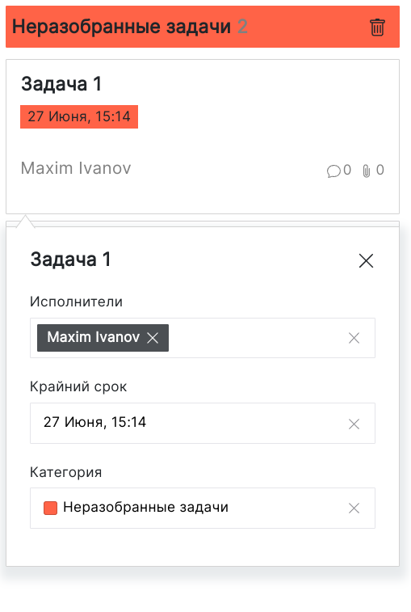
2. Перемещение задачи между соседними состояниями
   1. 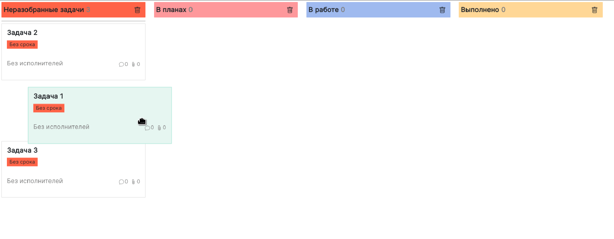
   2. 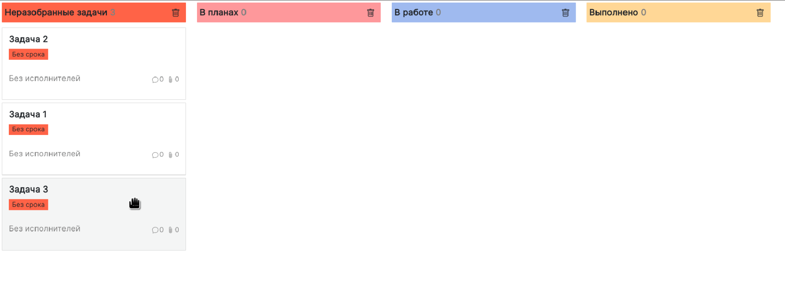
3. Перемещение задачи между соседними состояниями
   1. 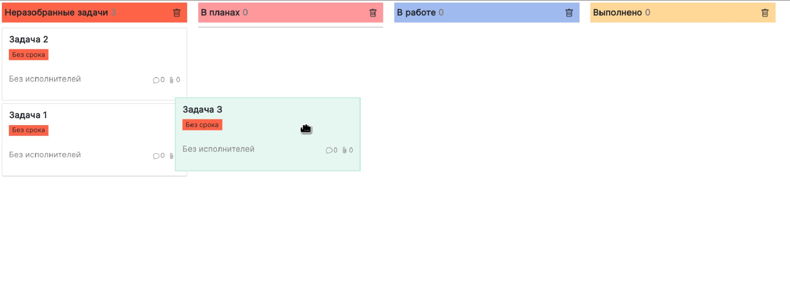
   2. 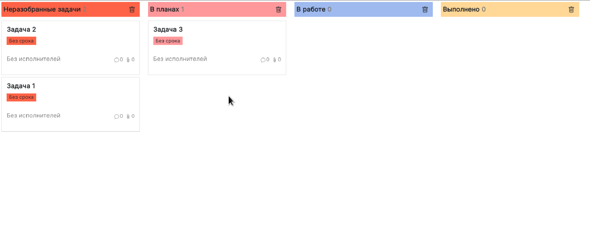
4. Перемещение задачи между состояниями, находящимися не около друг друга
   1. 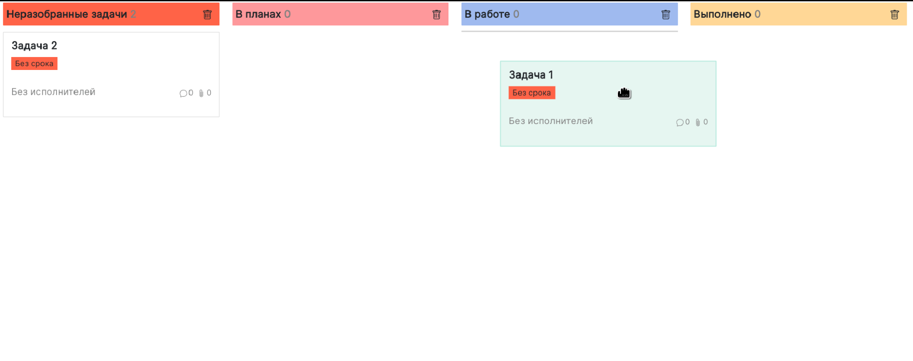
   2. 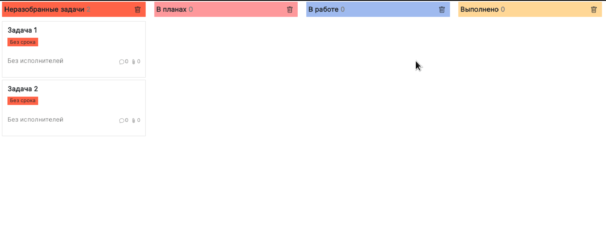
5. Форма создания
   1. 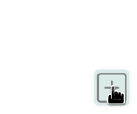
   2. 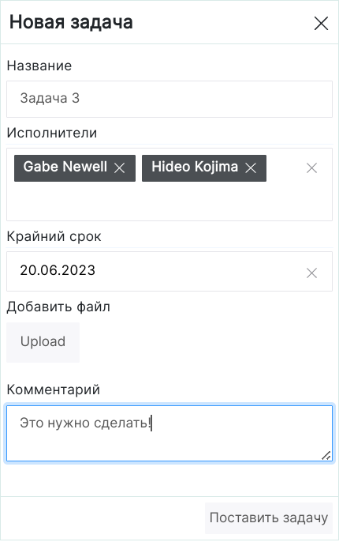
   3. 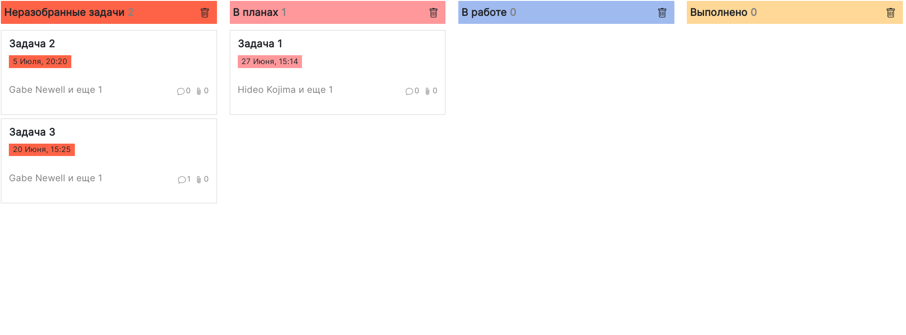
6. Форма обновления
   1. 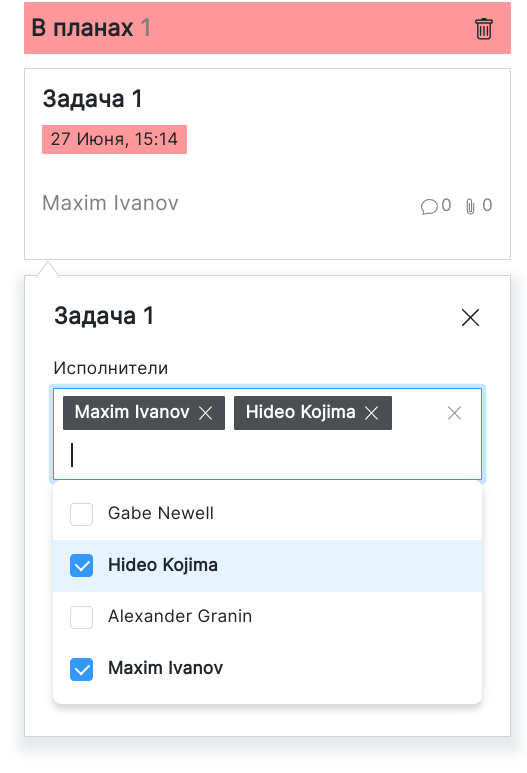
   2. 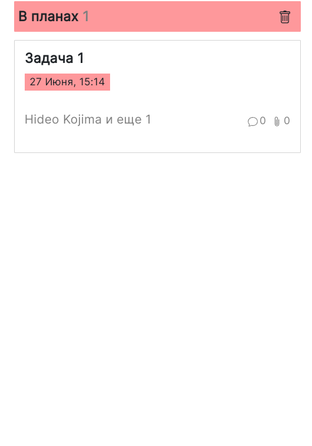
7. Удаление задачи
   1. 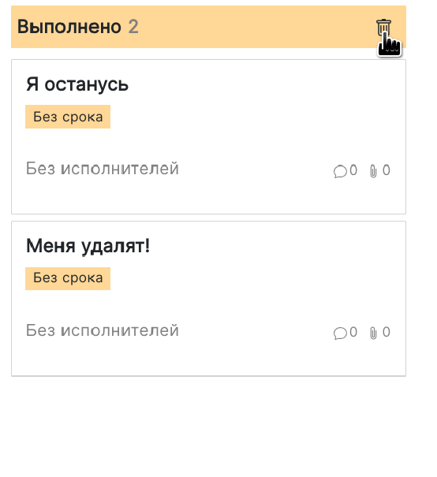
   2. 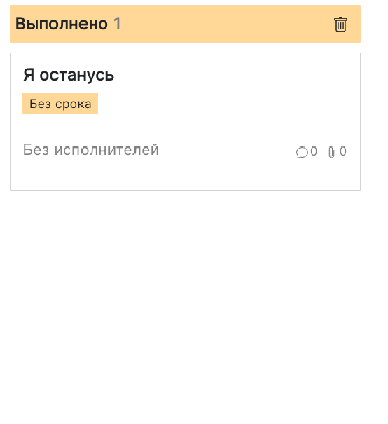

